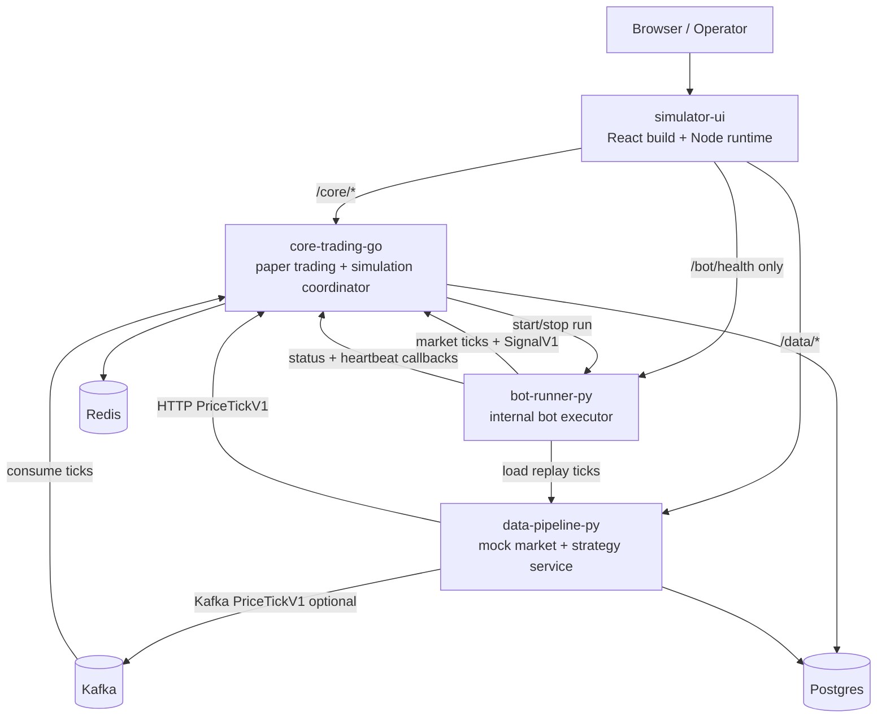

# Kiến trúc

Tạo lúc: 2026-04-28 15:54:33 +07

## Runtime tổng quan

## Trách nhiệm service

### `services/core-trading-go`

- Own paper runtime: account, positions, mark prices, orders, session, audit, report, timeline, pending executions, processed signal ids.
- Own simulation runtime: bot catalog, run lifecycle, experiment queue, child run promotion, metrics snapshots, heartbeat reconciliation, leaderboard.
- Persist state vào Postgres và restore latest state khi startup.
- Consume Kafka `PriceTickV1` tùy chọn; tick invalid/rejected được commit/continue để không halt consumer group.
- Emit structured request logs với request id và route context.

### `services/data-pipeline-py`

- Load market và strategy fixtures từ JSON.
- Expose latest quote, replay ticks, scenario catalog/detail, publish latest và replay publish.
- Expose strategy signal scenarios, list, publish và replay.
- Publish market ticks sang Core qua HTTP và tùy chọn Kafka.
- Có internal ops benchmark endpoints được bảo vệ bằng `OPS_BENCHMARK_ENABLED` và `X-Ops-Token`.
- Emit structured request logs với request id, scenario, strategy, transport và benchmark context.

### `services/bot-runner-py`

- Internal-only run executor với `POST /internal/runs/start` và `POST /internal/runs/{run_id}/stop`.
- Hỗ trợ `baseline-roundtrip:v1`, `buy-and-hold:v1`, `moving-average-cross:v1`.
- Load replay ticks từ data pipeline, validate thứ tự `(timestamp, symbol)`, validate bot config, publish ticks/signals sang Core và gửi status/heartbeat callbacks.
- Stop local loops mà không phát thêm signal sau khi stop.
- Retry Core tick/signal publish khi transport error hoặc HTTP `5xx`; không retry `4xx`.

### `services/simulator-ui`

- React/Vite TypeScript app với routes: `/dashboard`, `/sessions`, `/sessions/:sessionId`, `/lab`, `/runs`, `/runs/:runId`, `/experiments`, `/experiments/:experimentId`, `/leaderboard`.
- Node runtime serve built assets và proxy `/core/*`, `/data/*`.
- Chỉ expose bot runner health ở `/bot/health`; không proxy `/bot/internal/*`.
- Chặn browser access tới `/core/internal/ops*` và `/data/internal/ops*`.
- Emit structured request logs với request id, upstream, status, duration và route ids.

## Persistence

- Core/Postgres là durable source of truth cho paper và simulation state.
- Migrations hiện chạy đến `0009_add_order_session_scope`.
- Bảng chính:
  - `paper_accounts`
  - `paper_orders`
  - `paper_positions`
  - `market_prices`
  - `paper_sessions`
  - `paper_audit_events`
  - `simulation_bots`
  - `simulation_bot_versions`
  - `simulation_runs`
  - `simulation_experiments`
- `StateStore.SaveState` là snapshot-oriented: upsert account/session state, rewrite current order/position/market snapshots, lưu audit/report snapshots, processed signals, market profile snapshot và pending execution snapshot.
- Cách này phù hợp deterministic local simulator restore, nhưng không phải high-throughput event-sourced write model.

## Quyết định K8s

- Helm chart: `k8s/helm/crypto-simulator`.
- `Postgres` và `Kafka` persistent mặc định.
- `Redis` vẫn ephemeral.
- `core_trading.replicaCount` giữ `1`; không HPA cho đến khi thiết kế lại state ownership.
- `data_pipeline` có thể dùng HPA qua HA profile/demo.
- Public default exposure là Ingress tại `simulator.localtest.me:18020`.
- Optional exposure profiles hỗ trợ NodePort và LoadBalancer/MetalLB.

## Ranh giới singleton của Core

`core_trading` đang điều phối mutable runtime ownership cho current session, active run, active experiment và bot runner callbacks. Scale ngang chỉ an toàn sau khi có:

- partition ownership theo `session_id`, `run_id` hoặc `experiment_id`
- distributed lease/lock với fencing token
- durable reconciliation idempotent trước duplicate/out-of-order callbacks
- queue fairness policy cho experiment promotion

Cho tới lúc đó, chỉ scale `data_pipeline` hoặc UI cho demo; không scale Core.
