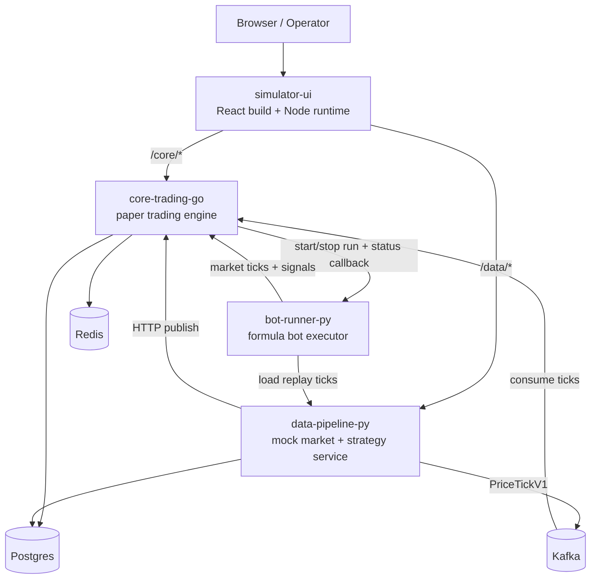

# Architecture Overview

Tài liệu này mô tả kiến trúc thật đang có trong repo ở thời điểm hiện tại. Nếu source code khác tài liệu, ưu tiên source code và cập nhật lại file này.

## 1. High-Level Runtime

## 2. Service Responsibilities

### `services/core-trading-go`

- Lõi paper trading hiện tại.
- Giữ runtime session, orders, positions, audit, report, timeline.
- Giữ simulation run/experiment registry, execution profile snapshots, market profile snapshots, metrics snapshots, leaderboard query.
- Có state persistence vào Postgres và restore sau restart.
- Đây là service `stateful` theo thiết kế hiện tại, nên local K8s **không** scale ngang service này bằng HPA như một stateless API thông thường.

### `services/data-pipeline-py`

- Cấp quote mock, replay market data, publish strategy signals.
- Expose replay scenario catalog để operator/bot chọn dataset benchmark có metadata rõ ràng.
- Có thể đẩy tick sang Go qua HTTP hoặc Kafka.
- Có internal benchmark endpoints phục vụ HPA demo nội bộ:
  - `POST /internal/ops/benchmark/cpu`
  - `POST /internal/ops/benchmark/memory`
- Endpoints benchmark bị khóa bằng `OPS_BENCHMARK_ENABLED` và `OPS_BENCHMARK_TOKEN`.

### `services/bot-runner-py`

- Chạy deterministic simulation bots trên replay ticks từ `data_pipeline`.
- Hiện seed sẵn `baseline-roundtrip`, `buy-and-hold`, `moving-average-cross`.
- Không expose public browser API; toàn bộ flow đi qua `core_trading` để giữ một simulation contract thống nhất.

### `services/simulator-ui`

- Frontend `React + Vite + TypeScript`.
- Runtime production là Node server serve bundle và proxy same-origin:
  - `/core/*` -> `core-trading-go`
  - `/data/*` -> `data-pipeline-py`
- Runtime UI chặn browser access tới `/core/internal/ops*` và `/data/internal/ops*`.
- Operator routes hiện tách rõ:
  - `/dashboard` cho current session live monitor
  - `/sessions` và `/sessions/:sessionId` cho historical session reads
  - `/runs`, `/runs/:runId` cho single-run workflow
  - `/experiments`, `/experiments/:experimentId` cho sequential batch workflow
  - `/leaderboard` cho completed standalone-run ranking

## 3. Local Runtime Shapes

### Docker Compose

- Dùng làm fallback runtime và quality-gate path.
- Public host ports:
  - `18080` -> core trading
  - `18000` -> data pipeline
  - `18020` -> simulator UI

### Kubernetes `kind + Helm`

- Helm chart nằm ở `k8s/helm/crypto-simulator`.
- `make k8s-kind-up` bootstrap luôn:
  - `ingress-nginx`
  - `metrics-server`
  - `MetalLB`
- Public shape mặc định là `Ingress` tại `http://simulator.localtest.me:18020`.
- Có thêm override cho:
  - `values-dev-ephemeral.yaml`
  - `values-ha.yaml`
  - `values-exposure-nodeport.yaml`
  - `values-exposure-lb.yaml`
  - `values-static-pv-demo.yaml`

## 4. K8s Design Decisions

- `Postgres` và `Kafka` mặc định bật persistence trong chart.
- `Redis` vẫn để ephemeral vì đây chưa phải state tier chính của simulator.
- `data_pipeline` là workload stateless đầu tiên được gắn `HPA`.
- `core_trading` vẫn giữ `replicaCount: 1` vì session/runtime hiện chưa an toàn cho horizontal scaling.
- `simulator_ui` hỗ trợ `ClusterIP`, `NodePort`, hoặc `LoadBalancer`; `Ingress` là public mode mặc định.
- Chart đã có `PDB`, rollout strategy, health probes, resource requests/limits, ConfigMaps, Secrets và demo static PV cho Postgres.

## 5. Simulation Evaluation Flow

### Single runs

1. Operator tạo standalone run qua UI `/runs` hoặc gọi `POST /api/sim/runs`.
2. `core-trading-go` resolve bot version, merge `bot_config`, chụp `execution_profile_snapshot`, chụp `market_profile_snapshot`, rồi mở paper session mới.
3. `bot-runner-py` lấy replay ticks theo `scenario_id` từ `data-pipeline-py`, publish market ticks và signals trở lại `core-trading-go`.
4. Khi run hoàn thành hoặc bị dừng, `core-trading-go` persist `metrics_snapshot` và `stopped_reason`.
5. UI đọc lại `/api/sim/runs/:runId` và `/api/sim/leaderboard` để xem lịch sử immutable và ranking `completed standalone runs only`.

### Batch experiments

1. Operator tạo experiment qua UI `/experiments` hoặc gọi `POST /api/sim/experiments`.
2. `core-trading-go` expand matrix `bots × scenarios × repetitions`, persist experiment snapshot, và nếu singleton engine đang bận thì batch vào trạng thái `queued`; khi được cấp ownership nó vẫn chỉ tạo **một** child run tại một thời điểm.
3. Mỗi child run vẫn reuse cùng simulation contract như standalone run, được gắn `experiment_id`, và runner phải gửi heartbeat về `core-trading-go` trong suốt vòng đời run.
4. Khi child run terminal, coordinator update counters và start slot kế tiếp theo kiểu just-in-time; nếu heartbeat stale thì run bị fail với `runner_lost`, và coordinator tiếp tục reconcile/restore sau restart.
5. UI đọc `/api/sim/experiments/:experimentId`, `/summary`, và `/api/sim/runs?experiment_id=...` để xem progress, queue ownership, child runs, và aggregate compare theo `(bot_id, bot_version, scenario_id)`.

`microstructure_profile` từ catalog hiện đã đi vào execution realism v1 trong engine: `signal latency`, `spread`, `per-tick fill cap`, và `split-fill` ảnh hưởng trực tiếp tới execution path, đồng thời snapshot vẫn được persist trên run detail để replay/compare đúng context.
