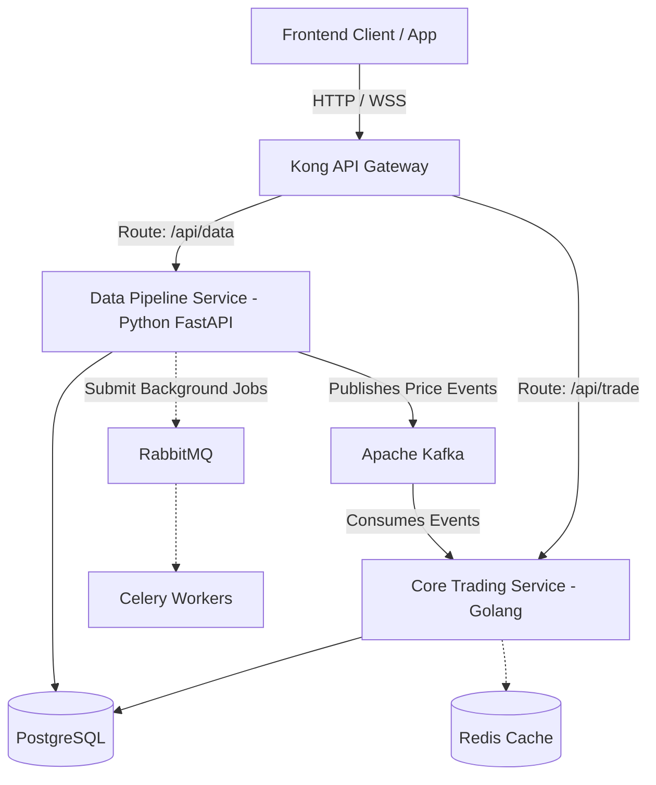

# Architecture Overview 🏗️

Tài liệu này giải thích chi tiết kiến trúc của hệ thống **Crypto Trading Simulator**, giúp developers và AI Assistant hiểu rõ bức tranh tổng thể trước khi code.

## 1. High-Level Architecture (Cấu trúc Tổng quan)

Mô hình hệ thống chia thành 3 lớp phân tán (Decoupled Layers):

## 2. Chi tiết các thành phần (Components)

### A. Core Trading Service (Viết bằng Golang)
- **Nhiệm vụ:** Là lõi tính toán và phục vụ API trực tiếp với độ trễ thấp (Low-latency). Nó sẽ mở WebSocket với client, nhận dữ liệu giá theo thời gian thực phân tích ra biểu đồ kỹ thuật (RSI, MACD) bằng tốc độ của nhân CPU.
- **Tại sao lại dùng Go?** Tận dụng *Goroutines* để phân nhỏ (Multi-threading) quy trình chạy Bot Trading cho hàng ngàn Users cùng lúc mà không sợ overhead hay nghẽn bộ nhớ.

### B. Data Pipeline Service (Viết bằng Python)
- **Nhiệm vụ:** Chuyên cào dữ liệu (Crawling), quét các chỉ số kinh tế tự động, hoặc hút nến OHLCV từ Binance.
- **Tại sao lại dùng Python?** Mảng crawl dữ liệu luôn I/O Bound nặng nề, Python kết hợp thư viện bất đồng bộ `asyncio` là vũ khí tối thượng. Mặt khác, hệ thống dùng thêm `Celery` để quản trị cron job (vd: quét lúc 0h khuya mỗi ngày).

### C. Message Broker (Kafka)
- **Tại sao cần nó?** Tốc độ cập nhật giá của tiền ảo lên tới hàng trăm event mỗi giây. Nếu Service Python cào được xong gọi `HTTP POST` hoặc `INSERT SQL` thẳng sang Service Go, database sẽ sập ngay lập tức do nghẽn cổ chai (Bottleneck). Thay vào đó, Python cứ việc vứt giá vào Kafka. Golang rảnh lúc nào thì hút từ Kafka về xử lý ở bộ nhớ đệm (In-memory) -> Tối ưu hóa Database.

## 3. Deployment Flow (DevOps & K8s)

- **Local Development:** Để code tiện lợi, cả khối cấu trúc này sẽ được cấu hình trong 1 file `docker-compose.yml`. Lệnh `docker-compose up -d` sẽ dựng toàn bộ Postgres, Redis, Kafka ở port nội bộ.
- **Production (K8s Phase):** Sau khi source code ổn định, toàn bộ kiến trúc được bóc tách thành các YAML files:
  - `Deployment`: Để chạy các App.
  - `HorizontalPodAutoscaler (HPA)`: Cố tình bắn tải API bằng JMeter. Khi CPU đạt 80%, K8s tự động đẻ ra thêm 3-4 Pods Golang đứng dàn hàng ngang xử lý giúp.
  - `Service (ClusterIP/NodePort)`: Phân giải mạng DNS nội bộ.
